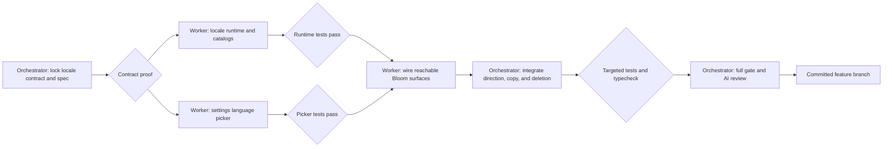

# Arabic UI localization and RTL

Status: complete

Project: Murmur mobile

Date: 2026-08-11

## Background

Murmur can translate speech to and from Arabic, and Arabic captions already use right-to-left text. The app shell is still English-only, its layout stays left-to-right, and user-facing numbers use Latin digits.

The desired state is a bilingual app shell with English and Modern Standard Arabic (MSA) as independent UI languages. A user can change the UI language in Settings. The choice survives a browser reload and a native app restart. Arabic changes the whole shell to right-to-left and formats user-facing numbers with Arabic digits. Speech source and target languages keep their own direction rules and do not change when the UI language changes.

## Done

- [x] English and MSA Arabic catalogs are bundled with the app and owned in Git.
- [x] Settings offers English and العربية as UI languages and shows the active language.
- [x] A valid saved choice restores before the main UI renders; a missing, unreadable, or invalid choice uses English without guessing or rewriting storage.
- [x] Browser persistence uses local storage through Murmur's local-storage boundary. Native builds use the same boundary and its secure-store implementation.
- [x] RTL is derived only from the active UI locale: `en → ltr`, `ar → rtl`. Switching locale updates root views and every native modal without a process restart.
- [x] Arabic formats user-facing counts, steps, durations, and clock values with Eastern Arabic-Indic digits (`٠١٢٣٤٥٦٧٨٩`). Opaque IDs, protocol values, URLs, error codes, exported diagnostics, and user or translated content are unchanged.
- [x] Current Bloom onboarding, home, settings, language pickers, reports, diagnostics, status, errors, and accessibility labels use the catalogs.
- [x] Existing transcript direction remains derived from the selected speech language.
- [x] Catalog parity, locale restore, number formatting, switcher behavior, and representative RTL rendering have automated tests.
- [x] `pnpm run gate` passes, an AI-only review has no unresolved critical finding, CHANGELOG is updated, and the work is committed on `feature/arabic-i18n-rtl`.

The work stops at UI localization. Store metadata, legal-page translation, worker responses, speech-language behavior, device-locale auto-selection, and machine-readable diagnostic exports are out of scope. Old components that are not reachable from the Bloom app or its supported previews do not need catalog migration.

### Acceptance matrix

| Surface | English proof | Arabic proof |
| --- | --- | --- |
| `app/index.tsx` current Bloom route | Existing direct tests keep their deterministic English fallback. | A provider rendering test restores `ar` before the route and applies RTL. |
| Bloom onboarding: welcome, privacy, language setup | App-owned copy and accessibility labels come from `en`. | The same keys render MSA copy, RTL layout, and Arabic step digits. |
| Bloom home: chrome, empty/live timeline, controls, errors, receipt | App-owned copy comes from `en`; speech content remains untouched. | Shell copy is MSA; an English source stays explicit LTR and an Arabic target stays explicit RTL. The inverse pair is also tested. |
| Settings, app-language view, speech-language picker, report, diagnostics | Labels, states, and display numbers use `en`. | Each native modal has explicit RTL; directional chevrons mirror; display numbers use Arabic digits. |
| `app/preview.tsx` and direct `src/home/preview.tsx` fixtures | Existing previews render through the context's English fallback without new setup. | One focused rendering fixture wraps a preview surface in the Arabic provider. Store screenshot generation is unchanged. |

The reachable copy inventory is `homeScreen.tsx`, `experience.tsx`, `settingsModals.tsx`, `modalSheet.tsx`, `languagePicker.tsx`, `reportTranslation.tsx`, `diagnosticsModal.tsx`, `errorCopy.ts`, `statusLabels.ts`, `viewModel.ts`, `variants/onboardingFlow.tsx`, `variants/shared.tsx`, `variants/sharedControls.tsx`, and the current `variants/bloom/*` files. Brand names, URLs, provider routes, IDs, protocol values, preview fixture content, user speech, and model translations are allowlisted non-catalog text.

## Behavior

English is the deterministic default. Murmur does not infer a UI language from the device or from the source or target speech language.

Changing the UI language is immediate. Murmur serializes writes and uses the last requested locale when changes overlap. The app-language view returns to Settings after a successful save. If saving rejects, the visible choice returns to the last persisted locale, the view stays open, and its error uses that persisted locale.

The Delete local data action removes the saved UI locale with the other local preferences and resets the provider to English only after every deletion succeeds. A deletion failure keeps the current in-memory locale and uses the existing localized failure path.

Translation text keeps its semantic direction. An English UI can show an Arabic translation right-to-left, and an Arabic UI can show an English translation left-to-right.

## Language

| Term | Meaning |
| --- | --- |
| UI locale | The language of Murmur's buttons, labels, messages, and accessibility text. |
| Speech language | The source or target language used by live translation. It is independent of the UI locale. |
| MSA Arabic | The neutral `ar` catalog used for this release. |
| Direction | `ltr` or `rtl`, derived from the exact UI locale. |
| Catalog | A typed, bundled map of message keys to Git-owned copy. |

The supported UI locale union is exactly `en | ar`. Future `ar-SA` and `ar-AE` are separate switcher languages with separate catalogs and exact persisted values. The runtime must not silently collapse those future locales into `ar`; today both values are invalid and restore as English.

## System

The locale runtime owns four things: the exact locale, its derived direction, message lookup, and number formatting. It sits above the Expo Router stack so onboarding, the main shell, and modal sheets read one source of truth.

Catalogs are flat TypeScript data with English as the type source. Arabic must have exactly the same keys at compile time, with no missing or extra keys. Dynamic values use named `{value}` interpolation, both catalogs must expose the same placeholder names for each key, and tests fail on unknown keys or missing values. Locale helpers format only app-owned numbers; they never transform arbitrary strings.

On web, the provider also sets the document `lang` and `dir` attributes for its mounted lifetime. On every platform, the app root, every native `Modal`, reachable layout containers, and app-owned text use explicit locale direction and logical alignment. Transcript text always gets an explicit direction from its speech-language metadata, including an explicit LTR style. The implementation must not use global `I18nManager.forceRTL`, because that path needs reloads and can couple UI direction to process state.

The storage key is `murmur_ui_locale_v1`. Reads accept only an exact supported locale. Unknown values fall back to English without rewriting or guessing. Storage read errors also fall back to English. Storage write and delete errors reject so the caller can preserve the last good UI state. The UI locale uses its own `UiLocale` and `UiDirection` types and never imports or emits protocol `LanguageCode` values.

The context has a deterministic English fallback for direct unit tests and supported previews. The real provider wraps the Expo Router stack, gates route rendering until restore completes, then applies the theme background inside the locale root. On web it synchronizes `document.lang` and `document.dir` after restore.

Arabic display numbers use `Intl.NumberFormat("ar-u-nu-arab")`. Counts and onboarding steps use no grouping. Decimal values use the locale decimal mark and Arabic digits; signs come from the formatter. Elapsed values keep the existing units but localize the number and unit label through the catalog. Clock values preserve the existing timezone and 24-hour semantics while changing digits only. `buildLatencyEvidenceReport` and `formatLatencyEvidenceReport` remain machine-readable English with Latin digits.

## UI and accessibility

Settings gets an App language row with the active self-name as secondary text and a direction-aware chevron. It is available during and outside live sessions because it does not change speech configuration. Selecting it replaces the current Settings sheet body and title instead of opening a nested native modal. The replacement view shows English and العربية, keeps focus order equal to visual order, and returns to Settings only after a successful save.

Arabic mirrors shell order, sheet headers, settings rows, and language controls. Directional icons mirror; symmetric icons do not. Text uses locale-aware writing direction and start alignment. Brand art, microphone art, the timeline order, and progress order remain semantically stable.

All accessibility labels and state descriptions on reachable Bloom surfaces come from the active catalog, including settings, modal close actions, speech-language controls, primary action, audio control, setup progress, and dynamic status values. Rendering tests reject untranslated app-owned literals with explicit allowlists for brands, URLs, IDs, protocol values, preview fixtures, and user/model text. Focus order follows the visual order in each locale.

## Implementation

1. Add a dependency-free locale runtime, typed catalogs, exact-locale persistence, number and time helpers, and a root provider with a restore gate.
2. Add a self-contained App-language list that renders inside the existing Settings modal and consumes locale values through props.
3. Move reachable Bloom copy, error and status copy, modal copy, diagnostic display labels, and accessibility labels to catalog keys. Pure builders receive a translator; machine-readable export helpers stay unchanged. Apply direction at root and each modal, and fix directional controls and explicit transcript LTR.
4. Add focused unit and rendering tests. Update release notes, run the full gate, run one independent AI catalog review for MSA tone, context, placeholder parity, punctuation, digits, and protected literals, then run one bounded `codex review` for code. Critical or high findings block the commit; no human-language approval is required.

## Execution

### Node contracts

- The locale-runtime worker owns `apps/mobile/src/i18n/**` and focused tests only. Its public contract exports `UiLocale`, `UiDirection`, `useUiLocale`, `UiLocaleProvider`, exact storage helpers, `t`, `formatUiNumber`, and explicit UI/transcript direction styles. It must not edit existing UI files.
- The language-list worker owns only `apps/mobile/src/home/uiLanguageList.tsx` and its focused test. It receives locale, direction, labels, error, and async selection props; it must not import protocol languages or render a `Modal`.
- The surface migration stays one dependent implementation lane because its files share message keys and rendering decisions. It owns the reachable copy inventory except integration files `_layout.tsx`, `homeScreen.tsx`, `experience.tsx`, `settingsModals.tsx`, and `localStorage.ts`.
- The orchestrator owns those integration files, the spec, release notes, cross-lane conflict resolution, final verification, independent Arabic review, bounded code review, and commit.

## Anti-slop rules

- Do not add an i18n dependency for two bundled catalogs.
- Do not use speech-language codes as UI locales or make Arabic translation select the Arabic UI.
- Do not use substring locale matching such as `startsWith("ar")`; future regional Arabic locales are exact, separate choices.
- Do not translate brand names, URLs, provider routes, IDs, protocol values, or user and model content.
- Do not hardcode Arabic-Indic digits inside catalog messages when the value is dynamic.
- Do not rely on a manual RTL walkthrough as the proof. Automated tests, an independent AI catalog review, and bounded AI code review are the release evidence.
- Do not touch store metadata, worker code, legal pages, production, or unrelated launch work.
