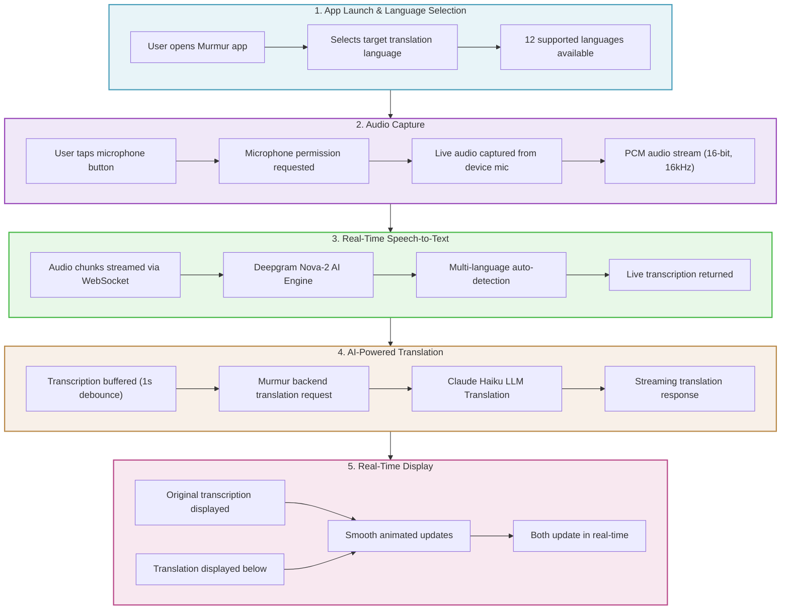
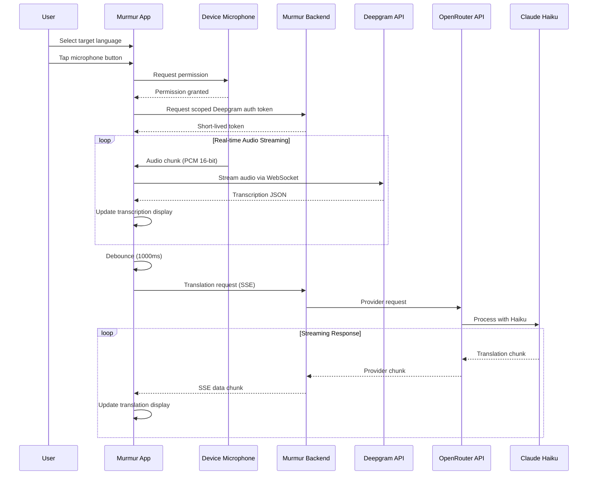
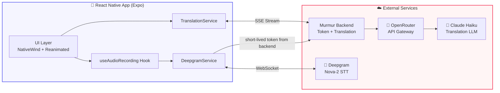

# Murmur - Real-Time Translation Architecture

## Technical Flow Details

## System Architecture

## Supported Languages

| Flag | Language | Native Name |
|------|----------|-------------|
| 🇪🇸 | Spanish | Español |
| 🇫🇷 | French | Français |
| 🇩🇪 | German | Deutsch |
| 🇮🇹 | Italian | Italiano |
| 🇵🇹 | Portuguese | Português |
| 🇯🇵 | Japanese | 日本語 |
| 🇨🇳 | Chinese | 中文 |
| 🇰🇷 | Korean | 한국어 |
| 🇸🇦 | Arabic | العربية |
| 🇷🇺 | Russian | Русский |
| 🇮🇳 | Hindi | हिन्दी |
| 🇳🇱 | Dutch | Nederlands |
