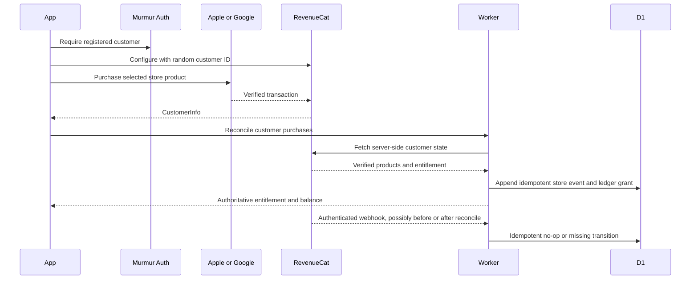
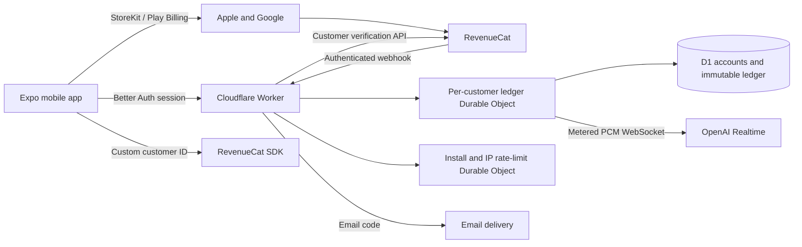
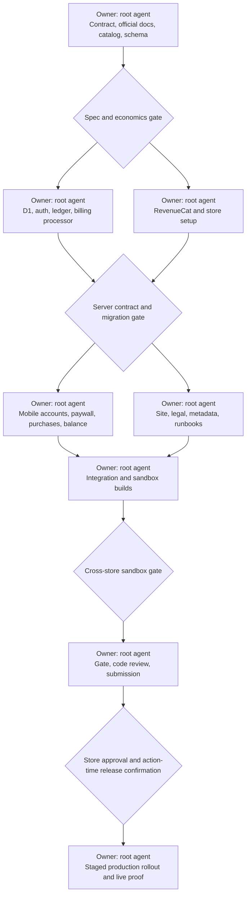

# Murmur Accounts, Billing, and Translation Credits

<!-- cspell:words Eurozone PKCE reauthenticates revenuecat rtdn tombstoned unmetered -->

## Background

Murmur is a guest-first, one-way live translator on iOS and Android. The mobile app creates a durable customer account, the Worker authenticates translation sessions, and the customer ledger Durable Object serializes allowance, credit, refund, and usage changes into D1. The Worker observes accepted PCM input and persists billable usage in milliseconds without retaining microphone audio or transcript history by default.

Murmur needs a sustainable paid service without weakening its privacy contract. A customer must be able to try the app for free, subscribe on either store, buy non-expiring translation credits, restore purchases, use one balance across supported devices, and receive correct balance changes after renewals and refunds. A client, delayed webhook, duplicate event, reinstall, reconnect, or store outage must not create or spend value incorrectly.

The final product has durable guest and registered customer accounts. Apple and Google remain the only purchase surfaces. RevenueCat normalizes store transactions and subscription state. Cloudflare D1 is the source of truth for customer ownership, entitlements, allowance grants, credit grants, translation usage, merges, renewals, cancellations, and refund reversals. Murmur continues to save no microphone audio or transcript history by default.

## Done

This work is complete when all of the following are observable:

- A new install receives a durable guest customer and 30 free translation minutes for the current UTC month without entering personal data. A hashed secure-storage claim prevents account deletion from minting a second grant for that installation in the same month.
- A guest can register or sign in with a verified email code without losing purchased value or usage history. A merge into an existing customer recomputes Free usage under one monthly cap instead of stacking two Free grants.
- A registered customer can buy Murmur Pro monthly or annual on iOS or Android, restore it on another supported device, and see the same server-owned entitlement and balance.
- A registered customer can buy any credit pack. Pack credits survive subscription expiry, app reinstall, and supported cross-platform sign-in.
- The Worker meters only accepted 24 kHz mono PCM16 input audio and refuses audio when no balance remains. Client-reported time never creates a debit.
- Renewals create exactly one allowance grant for each allowance cycle. Duplicate or reordered events do not create duplicate value.
- Cancellation preserves Pro through the paid-through time. Refund or revocation removes the affected value immediately and can produce a negative balance when already-spent value is reversed.
- D1 contains an immutable audit trail and a balance projection that can be rebuilt. RevenueCat and the mobile client cannot directly mutate balances.
- RevenueCat, App Store Connect, Play Console, Apple and Google authentication, email delivery, D1, Worker secrets, and store notifications are configured for sandbox and production.
- The app exposes pricing, purchase, restore, balance, usage exhaustion, subscription management, email recovery, and immediate account deletion with accessible loading and error states.
- The marketing site, privacy policy, terms, support and deletion page, store metadata, App Privacy answers, and Google Data Safety answers describe the final account and billing behavior.
- iOS sandbox and Google Play licensed-tester evidence covers purchases, renewals, restores, expiration, credit consumption, cancellation, refund, webhook retry, and cross-device sign-in.
- `pnpm run gate` passes, one post-implementation code review has no unresolved critical finding, the store builds pass preflight, and staged production releases are verified live.

The release does not add web checkout, a web account dashboard, family sharing, promotional grants, trials, intro offers, referral credits, gifting, credit transfers between customers, transcript history, or an unlimited plan.

## Product language

- **Customer** is Murmur's durable billing owner. A customer has one canonical random ID and can have a guest principal, a verified email-code principal, and aliases from merged guest sessions.
- **Guest** is a customer with an anonymous Better Auth principal and no personal sign-in method.
- **Registered customer** is a customer with a verified email principal.
- **Pro** is the single subscription entitlement.
- **Allowance cycle** is the period in which a Free or Pro allowance is available. Free uses a UTC calendar month. Pro uses monthly cycles anchored to the subscription purchase time, including twelve internal monthly cycles inside an annual subscription term.
- **Allowance** is expiring translation time granted by Free or Pro.
- **Credit pack** is non-expiring translation time bought as a consumable or one-time store product.
- **Available balance** is non-revoked, unexpired allowance plus non-expiring credits minus settled usage and refund reversals.
- **Ledger entry** is an immutable D1 record that creates, spends, releases, merges, or reverses value.
- **Store event** is a normalized RevenueCat purchase, renewal, expiration, cancellation, billing issue, transfer, or refund event.

## Catalog and economics

All internal quantities use integer milliseconds. Storefronts localize the base USD prices.

| Product | Store type | Included translation | Base price |
| --- | --- | ---: | ---: |
| Free | Server allowance | 30 minutes per UTC month | $0 |
| Murmur Pro Monthly | Auto-renewing subscription | 180 minutes per allowance cycle | $12.99/month |
| Murmur Pro Annual | Auto-renewing subscription | 180 minutes per internal monthly allowance cycle | $124.99/year |
| 60-Minute Credit Pack | Consumable / one-time product | 60 non-expiring minutes | $3.99 |
| 180-Minute Credit Pack | Consumable / one-time product | 180 non-expiring minutes | $10.99 |
| 540-Minute Credit Pack | Consumable / one-time product | 540 non-expiring minutes | $31.99 |

The pricing model uses the official OpenAI price of $0.034 per minute for `gpt-realtime-translate`, a conservative 30% store fee, and RevenueCat's 1% fee after its free monthly tracked-revenue threshold. At full use, at least 10% of each paid product's base price remains after those variable costs: Monthly 21.89%, Annual 10.24%, and the 60, 180, and 540-minute packs 17.87%, 13.31%, and 11.61%. Annual is 19.82% below twelve monthly payments and grants the same monthly value. Free usage and Cloudflare and email costs are acquisition and operating costs outside this product-level contribution calculation. Revisit the catalog when provider or platform prices change.

Pro replaces Free for an allowance cycle; it does not stack 180 paid minutes on top of 30 free minutes. An upgrade during a Free cycle increases that cycle's total allowance cap to 180 minutes, so a customer who already used 3 free minutes receives 177 remaining Pro minutes. Allowance never rolls over. Credit packs never expire and remain after Pro ends. Usage consumes current expiring allowance first, then the oldest non-expiring credit grant.

## Customer behavior

### First use and registration

The app creates a Better Auth anonymous session on first use and receives a random Murmur customer ID from the Worker. The customer ID, auth session, and RevenueCat App User ID are kept in secure device storage. The RevenueCat App User ID is the Murmur customer ID, never an email, install ID, store account ID, advertising ID, or predictable value.

Free translation does not require personal data. Purchase, restore, subscription management, and cross-device access require registration. The paywall explains this before starting authentication.

When a guest registers or signs in to an existing registered account, the verified registered customer becomes canonical. After authentication, the Worker creates a merge intent and computes the result in one D1 batch. The guest becomes an alias, both customers' Free usage resolves under one monthly cap, open guest usage sessions close, and the anonymous auth record is removed. Purchases pause during the merge. The app logs RevenueCat into the canonical customer ID, refreshes cached CustomerInfo, and the Worker replays pending events after every alias resolves to the canonical ID. A guest cannot own paid value because purchase requires registration. The app shows the resulting registered balance before it leaves the merge flow. Ledger history is never rewritten.

Settings lets a guest add a verified email or sign in to an existing verified email account. Better Auth proves control of the destination account before the Worker merges the guest customer into it. Store identities remain store-side purchase proofs and never become Murmur login methods.

### Purchase and restore

The app never grants time from `CustomerInfo`, a receipt, a purchase token, or a client success callback. It calls the Worker reconciliation route and waits for the D1 result. A delayed webhook is normal. Reconciliation and webhooks use the same idempotent store-event processor.

Restore calls the platform restore API for subscriptions, then server reconciliation. Apple consumables and Google one-time products are never granted again from a platform restore. Their non-expiring balance is recovered from D1 after registered sign-in. Server reconciliation paginates RevenueCat API v2 `GET /projects/{project_id}/customers/{customer_id}/purchases` and the subscription resource for both sandbox and production, processes each verified transaction ID once, and imports missed non-renewing purchases and voids. A purchase remains managed on its original platform even when its entitlement and balance are usable elsewhere. The app opens the correct platform subscription-management page.

### Cancellation, billing failure, expiration, and refund

| Verified store state | Pro usable | Existing Pro allowance | New allowance grant |
| --- | --- | --- | --- |
| Active | Yes | Spendable | Yes at the next covered cycle |
| Canceled but paid through | Yes | Spendable | Yes for annual internal cycles covered by the paid term |
| Billing issue with active grace | Yes, with billing warning | Spendable | No until payment recovery is verified |
| Apple billing retry without grace | No | Frozen | No |
| Google account hold | No | Frozen | No |
| Google pause scheduled | Yes through current paid term | Spendable through current term | No after pause starts |
| Expired or pause started | No | Expires at the verified paid-through time | No |
| Refunded or revoked | No | Reversed for every affected cycle | No |
| Deferred or pending purchase | No new entitlement | Unchanged | No |

Cancellation turns off renewal but keeps Pro active through the verified paid-through time. A product change preserves the same uninterrupted Pro episode and allowance anchor, so it cannot create another grant in the same cycle. Billing recovery can reactivate the existing cycle but cannot duplicate its grant.

A full subscription refund or revocation reverses every existing Pro grant whose cycle belongs to the refunded store term and blocks future grants from that term. Each reversal is unique by `(refund_event_id, grant_id)`. A partial monetary refund that does not revoke a verified period records the financial event but does not guess at a proportional time reversal; an ambiguous partial refund is held for audited support review. `REFUND_REVERSED` restores only the exact prior reversals. A credit-pack refund reverses that purchase's grant.

Reversal first removes unused value from the affected grant. Already-spent refunded value becomes a negative customer balance. A negative balance blocks translation until later valid grants offset it. A transfer between store customers uses an idempotent two-customer saga: revoke or freeze the source before granting the target, then reconcile both RevenueCat customers. Support cannot transfer credits manually without an audited adjustment.

### Exhaustion and offline behavior

The app shows remaining time before translation and while live. At zero, capture stops, buffered provider output can finish, and the app shows Free renewal timing, Pro, and credit packs. It never opens a purchase dialog automatically.

Translation cannot start offline. Store catalog failure leaves current translation and account management usable. D1, auth, or metering failure fails closed before more audio is forwarded upstream. A purchase that succeeded while reconciliation is unavailable reports a verification failure and can be recovered by Restore or the daily server reconciliation job.

## System

Better Auth runs inside the Worker with its Expo, anonymous, email OTP, Apple, and Google integrations. D1 stores Better Auth tables and Murmur billing tables. Email delivery uses a verified Murmur subdomain and a narrow API key. OAuth provider secrets, RevenueCat secret keys, webhook authorization, and email credentials remain Worker secrets.

RevenueCat is the store transaction verifier and event normalizer. D1 is authoritative for Murmur value. A per-customer ledger Durable Object is the single serialization boundary for all grants, reversals, merges, and usage settlements for that customer; it persists every committed change to D1 and cannot invent value outside the ledger. RevenueCat entitlements cannot answer how much translation remains, and RevenueCat virtual currency is not used.

### D1 records

Better Auth owns its generated user, session, provider account, verification, and anonymous-user fields. Murmur owns these cohesive tables:

| Table | Responsibility |
| --- | --- |
| `customers` | Canonical customer status and lifecycle |
| `customer_principals` | Better Auth user to Murmur customer mapping |
| `customer_aliases` | Immutable guest or merged customer resolution |
| `store_events` | Deduplicated normalized RevenueCat events and processing outcome |
| `subscription_cursors` | Monotonic lifecycle cursor per provider, environment, and subscription episode |
| `entitlement_projection` | Current Pro state and verified store period; can be rebuilt |
| `ledger_entries` | Immutable signed value changes in milliseconds |
| `allowance_periods` | Unique Free or Pro period, cap, cycle key, and grant status |
| `grant_projection` | Remaining value per Free, Pro, or pack grant; can be rebuilt |
| `usage_sessions` | Fenced customer translation generation, accepted audio, and settlement progress |
| `reconciliation_runs` | Auditable explicit restore and post-purchase reconciliation outcomes |
| `projection_versions` | Isolated projection build, ledger cutoff, and compare-and-swap state |
| `schema_migrations` | Applied schema version, backfill, compatibility, and rollback marker |

The schema enforces unique keys for `(provider, environment, event_id)`, auth principal subject, customer alias, subscription episode, allowance cycle, store transaction grant, `(refund_event_id, grant_id)`, `(usage_session_id, settlement_sequence)`, and the active customer lease. Duplicate calls return the existing result. Ledger entries are never updated or deleted. The customer ledger object writes a ledger entry, projection change, and cursor change in one D1 batch, checks every affected-row count, and acknowledges success only after commit.

Subscription lifecycle dedupe and ordering are separate. Each subscription episode has a cursor ordered by verified store effective time, event precedence, and stable event ID. An older cancellation, expiration, product change, or snapshot cannot overwrite a newer renewal. Refund and revocation transitions refer to their exact store term and remain independently reversible even when their event timestamp is older. Reconciliation derives its cursor from immutable RevenueCat subscription and purchase records; a fetch time alone is never treated as a newer store revision.

Projection rebuild writes a new isolated version from a fixed ledger cutoff. It becomes active only when the live ledger version still matches that cutoff. Migrations are additive during mixed-client rollout and carry an explicit schema version, backfill result, compatibility floor, and safe code rollback marker.

Account deletion is available immediately in-app for guests and registered customers, including customers with an active subscription. The app explains that deletion does not cancel Apple or Google renewal and keeps subscription management available before deletion. Better Auth enforces a fresh authenticated session. Immediate deletion closes usage, revokes D1 principals, deletes the Better Auth user and email fields, tombstones the customer, and rejects new purchases or restores against the tombstoned ID. A separate local Free allowance identifier is not rotated by account deletion or Reset Murmur Identity. Its server hash remains through the applicable UTC month so a replacement guest cannot mint another grant. The random RevenueCat App User ID, aliases, verified store transactions, and current-month Free claim remain only while subscription, refund, fraud, accounting, legal, or allowance-integrity handling requires them.

Future renewal or refund events for a tombstone are recorded against its pseudonymous store history but create no usable grant. Re-registration creates a new customer. A later verified store restore can transfer a still-active entitlement to the new customer through the explicit transfer saga; it never resurrects deleted identity data. Store transaction and ledger records are retained for seven years after the related CollabEZ tax period for accounting, refund, fraud, and UAE corporate-tax obligations. D1 Time Travel can retain deleted fields for up to 30 days before backup expiry. All other personal account data is erased immediately or when the named processor completes its deletion request.

### Metering and concurrency

Mobile capture is 24,000 Hz mono PCM16, so 48 bytes equal one millisecond of input audio. The Worker counts only binary audio bytes that pass frame validation and are forwarded upstream. Silence is billable because it is accepted live input. Provider output, network wait, reconnect delay, and UI time are not billable.

`POST /v3/session` authenticates the customer and calls that customer's ledger Durable Object. The object ensures the correct allowance period exists, resolves the D1 projection, increments a fenced lease generation, and returns a generation-bound session. `/v3/realtime` is accepted by the same object, which owns both the client and upstream sockets. A new generation closes the prior socket before it can forward more audio.

Before forwarding a frame, the object checks the current fenced generation, authoritative remaining value, and a hard maximum of 5,000 unsettled milliseconds. It can never forward more unsettled bytes than the smaller of that maximum and the remaining balance. It settles accepted audio to D1 every five seconds and on clean close with the generation and settlement sequence. Refunds, grants, store events, and reconciliation for that customer pass through the same object, so they cannot race a settlement. Settlement retries use their unique sequence key. A restarted object reloads D1 and increments the generation before accepting a reconnect. A crash can lose at most five unsettled seconds in the customer's favor; stale workers and sockets cannot continue spending. A D1 settlement failure closes both sockets before another frame window is accepted.

Only one translation generation can be active per customer. The lease heartbeat expires abandoned sessions. Reconnect can reclaim the app session only through a new generation and the last committed settlement sequence; another device cannot spend concurrently. Tests force crash-after-forward, refund-during-session, expired-generation settlement, and two-device reconnect races. Existing install and IP rate limits remain abuse controls, not billing truth.

### Grant rules

Free grants use the unique key `free:<UTC YYYY-MM>` and are created lazily once per customer per calendar month. Active Pro hides Free value and usage cannot spend it. If Pro ends, the customer can receive the current Free period through the same idempotent grant path. Session rate limits and the existing optional App Attest or Play Integrity checks protect translation access; store-reviewed paid value does not depend on device-integrity availability.

An uninterrupted Pro entitlement creates an internal episode ID and retains one UTC anchor across monthly and annual product changes. Cycle `n` uses the key `pro:<episode_id>:<n>`. Its boundaries are calculated from the original anchor plus `n` calendar months, clamping the day to the last valid day of each target month without drifting the later anchor. A lapse closes the episode; a later purchase starts a new one. Product replacement, deferred change, annual renewal, missed webhook recovery, and billing recovery cannot create a second grant for an existing cycle. Annual Pro creates one 180-minute grant at each internal monthly boundary, not 2,160 minutes upfront.

A grant has `valid_from`, optional `expires_at`, original value, remaining projected value, source ledger entry, and optional store transaction. Free and Pro grants expire. Pack grants have no expiry. A Free-to-Pro upgrade computes one atomic cap transition from 30 to 180 minutes and subtracts Free usage already consumed in that UTC month; it cannot race a Free grant. Refund reversal refers to the original grants, so unrelated pack value is not silently relabeled.

### Worker interfaces

- Better Auth is mounted at `/api/auth/*`.
- `GET /v3/customer` returns the authenticated customer ID, registration state, Free or Pro plan, purchase kill-switch state, authoritative balance, expiry, and negative-balance state.
- Better Auth's authenticated delete-user operation performs immediate account deletion even when a store subscription remains active. The app warns that deletion does not cancel the store subscription.
- `POST /v3/billing/reconcile` fetches RevenueCat customer state server-side and processes each resource transition without duplication.
- `POST /v3/webhooks/revenuecat` enforces a 256 KiB body limit, compares a dedicated authorization secret in constant time, verifies RevenueCat's timestamped raw-body HMAC, validates the product allowlist and schema, and invokes the customer ledger object. It returns 2xx only after the store event, ledger, projection, and cursor commit; 5xx requests a RevenueCat retry after D1 or processing failure; 4xx is reserved for invalid authentication or payload.
- `POST /v2/session`, `/v2/realtime`, and `/v2/session/:id/stop` implement authenticated metered translation. The old `/v1/session` route returns a typed upgrade requirement instead of providing an unpriced permanent path.

API responses expose stable error codes such as `authentication_required`, `registration_required`, `allowance_exhausted`, `negative_balance`, `purchase_pending`, `billing_unavailable`, `account_merge_required`, and `client_upgrade_required`. They never expose receipt data, provider bodies, email codes, secrets, raw RevenueCat payloads, or transcript content.

## Store and RevenueCat configuration

### Canonical identifiers

| Surface | Identifier |
| --- | --- |
| RevenueCat project | `Murmur` |
| RevenueCat entitlement | `pro` |
| RevenueCat offering | `default` |
| Apple subscription group | `Murmur Pro` |
| Apple monthly product | `com.q9labsai.murmur.pro.monthly` |
| Apple annual product | `com.q9labsai.murmur.pro.annual` |
| Apple 60-minute product | `com.q9labsai.murmur.credits.60` |
| Apple 180-minute product | `com.q9labsai.murmur.credits.180` |
| Apple 540-minute product | `com.q9labsai.murmur.credits.540` |
| Google subscription | `murmur_pro` |
| Google base plans | `monthly`, `annual` |
| Google 60-minute product | `murmur_credits_60` |
| Google 180-minute product | `murmur_credits_180` |
| Google 540-minute product | `murmur_credits_540` |
| Google Cloud project | `murmur-billing-collabez` |
| Google Pub/Sub topic | `projects/murmur-billing-collabez/topics/murmur-play-rtdn` |
| Google service account | `revenuecat@murmur-billing-collabez.iam.gserviceaccount.com` |
| RevenueCat packages | `$rc_monthly`, `$rc_annual`, `credits_60`, `credits_180`, `credits_540` |

Apple products use one subscription group and two auto-renewing subscriptions. Credits are consumable in-app purchases. Google uses one subscription with monthly and annual auto-renewing base plans. Credits are consumable one-time products. No trial, introductory offer, prepaid plan, quantity purchase, or offer ID ships.

Each product must have active sandbox and production state, the base USD price from the catalog, storefront-generated regional prices reviewed in the United States, Saudi Arabia, United Kingdom, and Eurozone, digital-service tax category, all app-supported territories, and English localization. The subscription names are `Murmur Pro Monthly` and `Murmur Pro Annual`; their descriptions say `180 translation minutes each month`. Credit display names are `60 Translation Minutes`, `180 Translation Minutes`, and `540 Translation Minutes`; their descriptions say `Non-expiring Murmur translation credits`. Apple review screenshots use the final paywall. Google one-time products are explicitly consumable and both base plans are active and backward compatible.

RevenueCat maps every full store product or base-plan identifier to exactly one package in `default`. The `pro` entitlement attaches only to the monthly and annual packages. Credit packages have no RevenueCat entitlement because D1 grants their value from verified purchase transactions. The configured restore-transfer policy cannot move purchases to an unregistered guest.

RevenueCat receives the minimum Apple in-app-purchase credential and Google Play service-account access required by its current official setup. The Google topic grants Play publish access and RevenueCat subscribe access with exact IAM principals recorded in the runbook; Play Console sends subscriptions, voided purchases, and all one-time-product notifications. RevenueCat sends sandbox and production webhooks to the same Worker route with environment in the normalized event. Public SDK keys are platform-specific; secret API and webhook credentials never enter the app bundle.

The Apple Account Holder must accept the pending Developer Program agreement. Paid Applications, tax, and banking agreements must be active for CollabEZ FZE LLC on both stores before product submission.

Apple review notes give a fresh-install path through Continue as Guest, Sign in with Apple, the final paywall, Restore Purchases, Manage Subscription, and immediate Delete Account. They list the full Apple product IDs and explain that consumable balance recovery comes from the registered Murmur account, not StoreKit restore. Google App Access instructions give the equivalent guest and Sign in with Google path, list the subscription, base plans, and one-time product IDs, and explain account deletion and original-store management. Neither runbook assumes access to a private internal tester account; both are exercised from a fresh review build before submission.

## Mobile experience

The bloom UI remains the design direction. Billing extends the existing Settings and translation surfaces rather than adding a second navigation system.

- Settings shows customer status, remaining time, renewal or reset time, linked sign-in methods, Restore Purchases, Manage Subscription, Delete Account, support customer ID, privacy, and terms.
- The paywall shows Free, monthly Pro, annual Pro, and credit packs with native localized prices. Annual copy states that 180 minutes refresh each month; it never implies 2,160 minutes are granted at once.
- Purchase buttons remain disabled while the relevant store operation is running and cannot issue duplicate requests.
- Restore and purchase success appear only after D1 reconciliation.
- The live translation screen shows a quiet remaining-time indicator and a clear low-balance state without interrupting captions.
- Exhaustion stops capture cleanly and preserves the final visible translation span.
- Authentication explains why registration is needed for purchases and cross-device ownership. It does not claim that translation transcripts are stored.
- All controls have accessible names, dynamic type support, sufficient contrast, RTL-safe layout, screen-reader status updates, and reduced-motion behavior.

## Marketing, legal, and store surfaces

The Worker-rendered site adds pricing, allowance behavior, a billing FAQ, store download links, subscription-management help, restore help, and account deletion guidance. It does not sell digital products on the web and does not imply that customers can manage Apple purchases on Google or vice versa.

Privacy copy distinguishes anonymous and registered accounts and uses this implemented inventory:

| Data | Source and processors | Purpose and linkage | Retention and deletion | Store disclosure |
| --- | --- | --- | --- | --- |
| Email identity | Customer, Better Auth on Cloudflare, Resend | Account access; linked to registered customer | Until deletion, then erased; D1 Time Travel ages out within 30 days | Contact info / personal info, app functionality |
| Pseudonymous customer and provider subjects | Murmur, Better Auth, RevenueCat, Cloudflare | Cross-device ownership, fraud prevention, support | Active account life; tombstoned billing key retained for seven tax years | User ID / device or other identifiers, app functionality |
| Purchase, renewal, refund, and store transaction metadata | Apple, Google, RevenueCat, Cloudflare | Billing, entitlement, accounting, support | Seven years after the related CollabEZ tax period | Purchase history / financial info, app functionality |
| Allowance grants, credit grants, and settled translation duration | Murmur Worker and D1 | Balance, metering, refund audit | Ledger retained for seven tax years; detailed usage-session rows de-identified after 30 days | Product interaction / app activity, app functionality |
| Device integrity result and abuse metadata | Apple App Attest, Google Play Integrity, Cloudflare | Session access and abuse prevention when required | Raw token never stored; result and IP logs 30 days | Device ID / device or other identifiers, fraud prevention |
| Email-code delivery | Customer, Better Auth, Resend | Authentication | Hashed OTP at most 10 minutes; delivery log at most 30 days; email erased on deletion | Contact info / personal info, app functionality |
| Diagnostics and optional translation report | App, Cloudflare, optional support webhook | Reliability and customer-requested quality review | Diagnostics 30 days; report content 30 days unless an active support case requires longer | Diagnostics and optional user content |
| Live microphone audio and captions | Device, Cloudflare transit, OpenAI Realtime | Live translation | No Murmur storage; processed only for the live request under the provider contract | Audio data, app functionality |

Murmur continues to state that it does not store microphone audio or transcript history by default. RevenueCat, Apple, Google, Cloudflare, Resend, and OpenAI are named as processors or independent store providers where applicable. The policy explains the seven-year UAE accounting retention and the 30-day D1 backup window instead of promising immediate erasure from backups.

Terms cover automatic renewal, localized store price and tax handling, cancellation through the original store, allowance expiry, non-expiring credits, refund reversals, negative balances, account linking, acceptable use, service availability, and store terms. Support copy explains Restore, pending purchases, duplicate charges, refunds, account deletion, and the customer ID support workflow.

Apple App Privacy and Google Data Safety must match the implemented collection and linking behavior. Store descriptions and screenshots remove accountless claims and show the final Free and Pro experience. Review notes provide a usable reviewer path and sandbox account only when the store requires one.

## Security, privacy, and operations

- Better Auth sessions use secure device storage, seven-day rolling server expiry, rotation, origin allowlists, OAuth state and PKCE, and rate-limited email codes. OTP values are hashed in D1, expire within 10 minutes, and are never logged.
- RevenueCat webhook authorization uses a dedicated high-entropy secret. The Worker also validates app, environment, product allowlist, customer ID format, timestamps, and transaction identity.
- Reconciliation uses RevenueCat's secret server API and never trusts client customer attributes for money or time.
- Store, auth, email, and OpenAI secrets are separate and least-privilege. Secret rotation has a runbook.
- Logs contain event IDs, pseudonymous customer IDs, product IDs, amounts of time, and stable error codes. They contain no receipt, purchase token, raw webhook payload, email address, OTP, audio, or transcript.
- Alerts cover webhook failures and lag, reconciliation failures, negative-balance spikes, grant duplication attempts, D1 settlement failures, auth delivery failures, pending purchases, and billing versus OpenAI cost drift. RevenueCat retry age and an internal failed-event queue provide dead-letter visibility without acknowledging an uncommitted event.
- A daily reconciliation job repairs missed webhooks from server-verified RevenueCat state without duplicating ledger value.
- Ledger and projection reconciliation can rebuild one customer or the full projection and report differences without mutating the immutable ledger.
- `BILLING_PURCHASES_ENABLED=false` blocks and hides new purchase starts while `BILLING_ENFORCEMENT_ENABLED=true` keeps balance reads, Restore, reconciliation, refunds, subscription management, account deletion, and translation metering active. Metering and D1 failures always fail closed; no purchase switch converts paid translation into unmetered use.

## Verification

Unit and integration tests cover pure catalog math, clamped allowance windows, upgrade deltas, plan replacement, grant expiry, allocation order, negative balances, stale and reordered events, idempotency, merge resolution, fenced session generations, byte-to-time conversion, settlement retry, crash recovery, deletion, and isolated projection rebuild.

Worker integration tests use D1 migrations and signed fixture events without live secrets. Mobile tests mock the billing port, not RevenueCat internals. Contract tests prove that old `/v2` clients keep their rollout behavior while `/v3` requires an authenticated customer and balance.

The sandbox matrix includes:

| Case | iOS | Android | Required proof |
| --- | --- | --- | --- |
| Monthly Pro purchase and renewal | Sandbox/TestFlight | Licensed tester/internal | One entitlement and one grant per cycle |
| Annual Pro purchase and renewal | Sandbox/TestFlight | Licensed tester/internal | Clamped monthly cycle IDs, no annual upfront grant |
| Monthly to annual and annual to monthly replacement | Sandbox/TestFlight | Licensed tester/internal | One uninterrupted episode, no duplicate cycle grant |
| Each credit pack and repeat purchase | Sandbox/TestFlight | Licensed tester/internal | One exact non-expiring grant per verified transaction |
| Subscription restore after reinstall | Yes | Yes | Same registered entitlement and balance |
| Pack recovery after reinstall | Yes | Yes | D1 and paginated purchase API recover balance; platform restore adds nothing |
| Cross-platform sign-in | Yes | Yes | Same D1 customer, original-store management link |
| Guest registration and existing-account merge | Yes | Yes | Canonical ID and Free cap resolve without stacking |
| Cancellation, grace, billing retry, hold, pause, and expiration | Yes | Yes | State table behavior and no grant during blocked states |
| Subscription refund/revocation | Yes | Yes | Immediate entitlement and grant reversal |
| Consumed pack refund | Yes | Yes | Negative balance when necessary |
| Full annual refund and refund reversal | Yes | Yes | Every affected cycle reverses once and restores once |
| Duplicate, stale, and reordered webhook | Yes | Yes | Cursor prevents regression and no duplicate ledger value |
| Pending, deferred, failed, and network-lost purchase | Yes | Yes | No early grant; later reconcile succeeds where paid |
| Exhaustion during translation | Yes | Yes | Exact server stop and clean final UI |
| Crash after forward and stale-worker reconnect | Yes | Yes | At most five seconds free; never overspend or double settle |
| Immediate deletion with active subscription | Yes | Yes | Identity erased, billing warning shown, tombstone records future events |
| Re-registration after deletion and verified restore | Yes | Yes | New customer ID; explicit store transfer, no identity resurrection |

Every sandbox artifact records platform and environment, RevenueCat event and purchase IDs, D1 ledger entries and cursor, final projection, visible UI result, and proof that no duplicate grant exists. Reviewer runbooks are executed from a fresh install separately from the internal tester matrix.

Production rollout deploys additive D1 migrations and dormant billing routes first, then RevenueCat and store configuration, then sandbox builds. The Worker enables `/v3` for store review without changing `/v2`. After approved builds are available, iOS uses phased release and Android uses 10%, 50%, then 100% staged rollout with balance, auth, purchase, webhook, crash, and OpenAI-cost monitoring at each gate. The legacy `/v2` grace window is announced before enforcement.

Rollout pauses and disables new purchase starts when any duplicate grant occurs; reconciliation or settlement failures exceed 1% for 15 minutes; webhook oldest retry exceeds 15 minutes; purchase-pending cases exceed 1% or 10 minutes; auth delivery failures exceed 5% for 15 minutes; negative-balance creation exceeds 0.5% of active customers in one day without a known refund batch; crash rate exceeds 1% or regresses by one percentage point; or OpenAI cost per settled minute drifts more than 5% from the catalog model. Existing balances, refunds, Restore, management links, and deletion stay available during a purchase kill. Code rollback must remain compatible with the additive schema and cannot roll back a committed ledger entry.

## Execution

### Phase checklist

- [ ] Contract, official source, dependency, economics, schema, and compatibility review is complete.
- [ ] D1 databases, migrations, auth, customer mapping, ledger, projections, reconciliation, and metering pass targeted tests.
- [ ] RevenueCat project, apps, products, offering, entitlement, credentials, notifications, and webhooks are configured.
- [ ] Apple and Google products, agreements, pricing, localizations, review information, and testers are configured.
- [ ] Mobile account, paywall, purchase, restore, balance, exhaustion, settings, and deletion flows pass accessibility checks.
- [ ] Site, legal, store metadata, privacy disclosures, Data Safety, and operational runbooks match the implementation.
- [ ] iOS and Android sandbox matrices have retained evidence.
- [ ] `pnpm run gate`, store preflight, one code review, and production safety checks pass.
- [ ] Store submissions are approved and staged production rollout is verified live.

## Anti-slop rules

- Do not call a RevenueCat entitlement or client receipt the Murmur balance.
- Do not use email, install ID, platform account ID, or RevenueCat anonymous ID as the durable customer key.
- Do not grant value from the client, a webhook without server validation, or a non-idempotent handler.
- Do not write D1 once per 20 ms audio frame or meter wall-clock session time.
- Do not mutate or delete ledger history to make a projection match.
- Do not stack Free and Pro allowances or grant an annual allowance upfront.
- Do not make consumable credits depend on an active subscription.
- Do not log raw provider payloads, receipts, tokens, email addresses, OTPs, audio, or transcripts.
- Do not break the live `/v2` client before the published compatibility window closes.
- Do not add web checkout, alternate billing, or external purchase links in this release.
- Do not submit products or release builds before sandbox refund and duplicate-event behavior is proved.

## Sources fixed for implementation

- [OpenAI API pricing](https://developers.openai.com/api/docs/pricing) establishes `gpt-realtime-translate` at $0.034 per minute at the time of this spec.
- [RevenueCat pricing](https://www.revenuecat.com/pricing) establishes free use through $2,500 monthly tracked revenue and 1% thereafter at the time of this spec.
- [RevenueCat Expo integration](https://www.revenuecat.com/docs/getting-started/installation/expo) establishes the native Expo build and SDK contract.
- [RevenueCat customer identity](https://www.revenuecat.com/docs/customers/identifying-customers) establishes random custom App User IDs for durable cross-platform ownership.
- [RevenueCat customer purchases](https://www.revenuecat.com/docs/api-v2/customer/resources) and [webhook events](https://www.revenuecat.com/docs/integrations/webhooks/event-types-and-fields) establish the paginated reconciliation and provider-event contracts.
- [Better Auth Expo integration](https://better-auth.com/docs/integrations/expo), [anonymous accounts](https://better-auth.com/docs/plugins/anonymous), and [D1 database support](https://better-auth.com/docs/concepts/database) establish the selected account boundary.
- [Apple account deletion](https://developer.apple.com/support/offering-account-deletion-in-your-app) and [Google Play account deletion](https://support.google.com/googleplay/android-developer/answer/13327111?hl=en) establish the immediate in-app and external deletion requirements.
- [Cloudflare D1 Time Travel](https://developers.cloudflare.com/d1/reference/time-travel/) establishes the backup-recovery window, while [UAE Federal Decree-Law No. 47 of 2022](https://tax.gov.ae/Datafolder/Files/Legislation/Corporate%20Tax/CT%20law%20final/Federal%20Decree-Law%20No.%2047%20of%202022%20-%20For%20publishing.pdf) establishes the seven-year corporate-tax record period.
